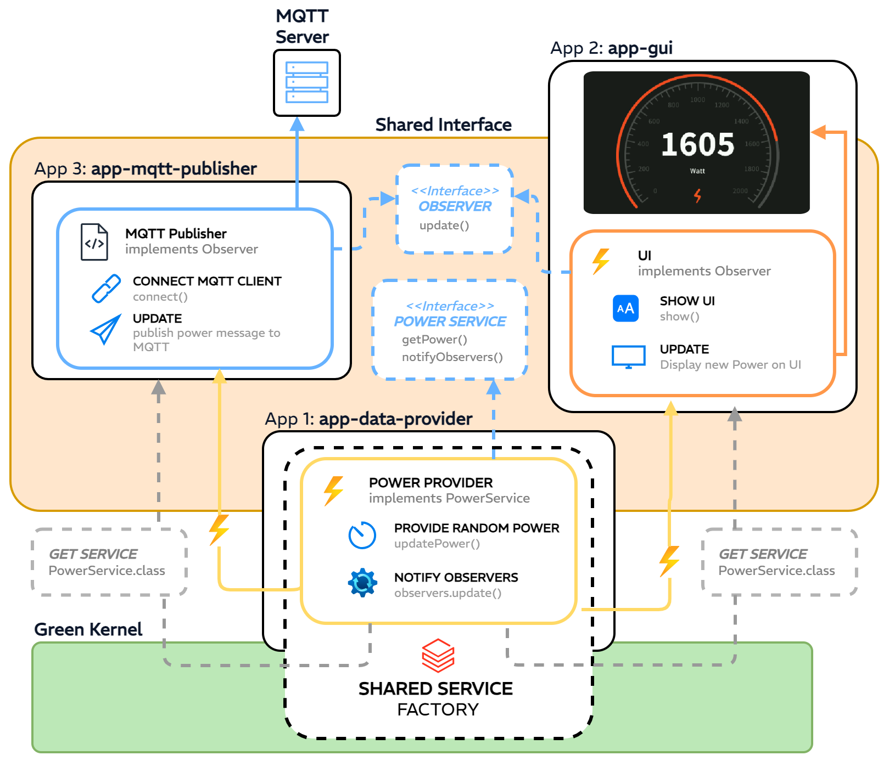
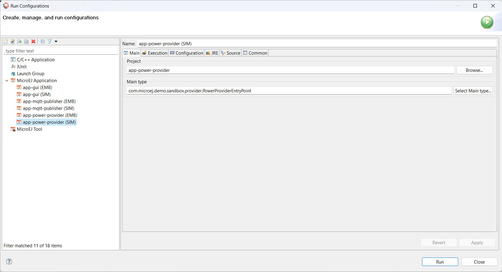
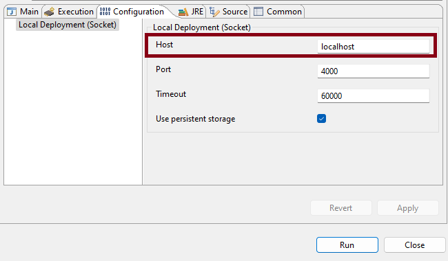

.. image:: https://shields.microej.com/endpoint?url=https://repository.microej.com/packages/badges/sdk_5.8.json
   :alt: sdk_5.8 badge
.. image:: https://shields.microej.com/endpoint?url=https://repository.microej.com/packages/badges/arch_8.0.json
   :alt: arch_8.0 badge
.. image:: https://shields.microej.com/endpoint?url=https://repository.microej.com/packages/badges/gui_3.json
   :alt: gui_3 badge

===========================
Demo Sandboxed Applications
===========================

Overview
========

This repository provides several applications that communicate together through the 
`Shared Interfaces <https://docs.microej.com/en/latest/ApplicationDeveloperGuide/sandboxedAppSharedInterface.html#chapter-shared-interfaces>`_ mechanism:

- ``app-power-provider``: app responsible for providing random power values in the system.
- ``app-mqtt-publisher``: app responsible for publishing the power values provided by ``app-power-provider`` to an MQTT topic.
- ``app-gui``: app responsible for visualizing the power values provided by ``app-power-provider``.
- ``sharedinterface``: shared library between apps that defines the shared interface for inter-app communication.

Find below an overview of the software architecture:

Requirements
============

- `MicroEJ Dist. 23.07 (MICROEJ SDK 5.8.0). <https://docs.microej.com/en/latest/SDKUserGuide/installSDKDistributionLatest.html#sdk-installation-latest>`_
- `GREEN Firmware 1.2.0. <https://repository.microej.com/packages/green/>`_

This demo has been tested on:

- `STM32F7508-DK VEE Port 2.0.0 <https://github.com/MicroEJ/VEEPort-STMicroelectronics-STM32F7508-DK/tree/2.0.0>`_ 
  running `Kernel GREEN 1.2.0 <https://github.com/MicroEJ/Kernel-GREEN/tree/1.2.0>`_.

Usage
=====

--------------------
GREEN Firmware Setup
--------------------

This section outlines the steps required to successfully use the GREEN Firmware on STM32F7508-DK.
For more information, please visit: `Get Started with Multi-Sandbox for STM32F7508-DK Discovery Kit <https://developer.microej.com/stm32f7508-dk-discovery-kit-get-started-multi-sandbox/>`_

Downloading the Virtual Device and the Multi-Sandbox Firmware
-------------------------------------------------------------

- Go to https://repository.microej.com/packages/green/.
- Select the folder with the latest version available (minimum 1.2.0).
- Download the Firmware:
    - Go into the ``firmwares/`` folder.
    - Select the folder corresponding to the device you want to use.
    - Download the ``.out`` file.
- Download the Virtual Device:
    - Go into the ``vd/`` folder.
    - Select the folder corresponding to the device you want to use.
    - Download the ``.vde`` file.

Importing the Virtual Device in MICROEJ SDK
-------------------------------------------

In MICROEJ SDK:

- Select ``File`` > ``Import`` > ``MicroEJ`` > ``Virtual Devices``.
- Point ``Select file`` to where the downloaded ``.vde`` file.
- The Virtual Device is available in the Target list, make sure it is selected.
- Accept the MicroEJ License Agreement and click on the Finish button.

The Virtual Device has been imported to your workspace and is ready to be used.

Deploying the Multi-Sandbox Firmware on the STM32F7508-DK
---------------------------------------------------------
The exact programming of a ``.out`` file onto a board is device dependent. 
As an example, the STM32F7508-DK will be used in the following steps.

Set up the STM32F7508-DK:

- Insert a microSD card in the board connector.
- Connect the Ethernet connector to the internet.
- Connect the USB connector of the board to your computer with a mini-USB cable.

Set up STM32CubeProgrammer:

- Open STM32CubeProgrammer.
- Go to ``External loaders`` tab in the menu.
- Select ``STM32F7508-DISCO`` board in the Available external loaders list.
- Click on ``Connect`` green button and wait until your board is connected.

Deploy the Multi-Sandbox Firmware:

- Go to ``Erasing & Programming`` tab in the menu of STM32CubeProgrammer.
- Point ``File path`` to your Multi-Sandbox Firmware (``.out`` file).
- Click on ``Start Programm...`` Wait for the programming to finish. 
  Sometimes, the programming may fail. Repeat it until it succeeds.

Set up the logs output:

- Get the COM port where your board is connected (if you are using Windows, you can open your Device Manager from the Windows menu).
- Set up a serial terminal (e.g. Termite) to see output logs from the board.

Once programmed:

- Click on the Reset button of the board.
- Get the IP address of your board. You will find it in the logs output. 

The Multi-Sandbox Firmware is running on the STM32F7508-DK and is ready to be used.

---------------------------------------------
Running an Application in Simulation
---------------------------------------------

Pre-configured launch configurations named with the ``(SIM)`` suffix are provided for each Application (e.g. ``app-power-provider (SIM)``).

To run an Application in simulation:

- Go to ``Run`` > ``Run Configurations``.
- Under ``MicroEJ Application``, select one of the launch configurations having the ``(SIM)`` suffix (e.g. ``app-power-provider (SIM)``).
- Go to the ``Execution`` tab, in the ``Target`` section select the ``VDE-GREEN`` Virtual Device imported earlier:

- Click on ``Run`` to execute the application.

Running Multiple Applications in Simulation
-----------------------------------------------------

To run multiple Applications in the Simulator, you can run one application as usual and add more applications to run with it in parallel, by adding them in a dropins folder.

For example, let's run ``app-power-provider`` and ``app-gui`` apps together. The ``app-power-provider (SIM)`` launcher will be used.

1. Build the ``sharedinterface`` project using ``Build Module``.
2. Build the ``app-gui`` app using ``Build Module``. A ``.wpk`` file is generated under the ``~target/artifacts`` folder of the ``app-gui`` project.
3. Move the ``.wpk`` under the ``app-dropins/`` folder of the ``app-power-provider`` project.
4. Run ``app-power-provider (SIM)``.

.. note:: You will need to rebuild and copy the ``.wpk`` file again if the app added in ``app-dropins/`` is updated.

Each application has its own drop-in folder. 
For example: ``${project_loc:app-gui}/app-dropins``. 

This folder is configured in the launch configuration of the application, under ``Configuration > Simulator > Applications``, it can be changed there if needed.

---------------------------------------------
Running an Application on the Device
---------------------------------------------

Pre-configured launch configurations named with the ``(EMB)`` suffix are provided for each Application (e.g. ``app-power-provider (EMB)``).

To run multiple Applications on the device, run every Application launch configuration.
The ``app-provider`` Launch configuration should be executed always first, so the other two apps(``app-mqtt-publisher`` and ``app-gui``) are able to get the power service.

To run an Application on the device:

- Go to ``Run`` > ``Run Configurations``.
- Under ``MicroEJ Application``, select one of the launch configurations having the ``(EMB)`` suffix (e.g. ``app-power-provider (EMB)``).
- Go to the ``Execution`` tab, in the ``Target`` section select the ``VDE-GREEN`` Virtual Device imported earlier.
- Go to the ``Configuration`` tab, set the ``Host`` value to the IP address of the device that runs the GREEN Firmware:

- Click ``Run`` to deploy and run the application on the device.

.. ReStructuredText
.. Copyright 2023-2024 MicroEJ Corp. All rights reserved.
.. Use of this source code is governed by a BSD-style license that can be found with this software.