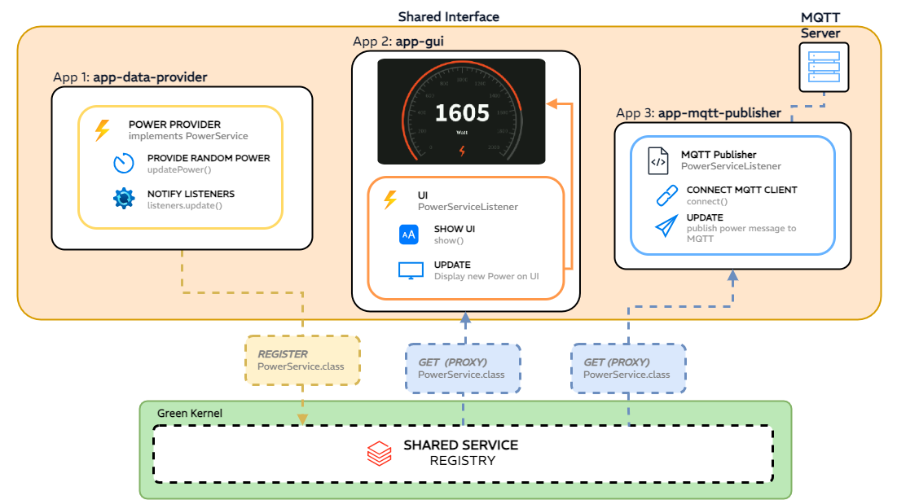

.. image:: https://shields.microej.com/endpoint?url=https://repository.microej.com/packages/badges/sdk_6.0.json
   :alt: sdk_6.0 badge
   :align: left
.. image:: https://shields.microej.com/endpoint?url=https://repository.microej.com/packages/badges/arch_8.0.json
   :alt: arch_8.0 badge
.. image:: https://shields.microej.com/endpoint?url=https://repository.microej.com/packages/badges/gui_3.json
   :alt: gui_3 badge

.. class:: center

Overview
========

This repository provides several applications that communicate together through the 
`Shared Interfaces <https://docs.microej.com/en/latest/ApplicationDeveloperGuide/sandboxedAppSharedInterface.html#chapter-shared-interfaces>`_ mechanism:

- ``app-power-provider``: app responsible for providing random power values in the system.
- ``app-mqtt-publisher``: app responsible for publishing the power values provided by ``app-power-provider`` to an MQTT topic.
- ``app-gui``: app responsible for visualizing the power values provided by ``app-power-provider``.
- ``sharedinterface``: shared library between apps that defines the shared interface for inter-app communication.

Find below an overview of the software architecture:

Requirements
============

The applications require:

- `MICROEJ SDK 6 <https://docs.microej.com/en/latest/SDK6UserGuide/index.html>`_,
- `GREEN Firmware 2.1.1 <https://repository.microej.com/packages/green/>`_.

They have been tested on:

- Android Studio with MicroEJ plugin for Android Studio 0.7.1,
- `VEE Port for NXP i.MX RT1170 2.2.0 <https://github.com/MicroEJ/nxp-vee-imxrt1170-evk/tree/NXPVEE-MIMXRT1170-EVK-2.2.0>`_
    - Running `Kernel GREEN 2.1.1 <https://github.com/MicroEJ/Kernel-GREEN/tree/2.1.1>`_.

Usage
=====

------------------------
Installing MICROEJ SDK 6
------------------------

Follow `MICROEJ SDK 6 Installation Guide <https://docs.microej.com/en/latest/SDK6UserGuide/install.html>`_ to setup the SDK.
As an example, Android Studio with the MICROEJ SDK 6 plugin will be used in the following steps.

-------------------------
Set-upping GREEN Firmware
-------------------------

This section outlines the steps required to successfully use the GREEN Firmware on the NXP i.MXRT1170
but this application can run on other GREEN Firmwares.

Downloading the Multi-Sandbox Firmware
--------------------------------------

- Go to https://repository.microej.com/packages/green/.
- Select the folder with the latest version available (minimum 2.1.1).
- Download the Firmware:

  - Go into the ``firmwares/NXP-MIMXRT1170_GCC/`` folder,
  - Download the ``.elf`` file.

Deploying the Multi-Sandbox Firmware on the NXP i.MXRT1170
----------------------------------------------------------

Set up the NXP i.MXRT1170 EVKB:

- Check that the dip switches (SW1) are set to OFF, OFF, ON and OFF,
- Ensure jumper J5 is removed,
- Insert a micro-SD card (FAT32-formatted) in the board connector,
- Connect the micro-USB cable to J86 to power the board,
- Connect the 1G Ethernet connector to the internet,
- Connect a 5 V power supply to J43.
For more information about the hardware setup check the `NXP i.MXRT1170 Getting started Hardware Setup <https://docs.microej.com/en/latest/SDK6UserGuide/gettingStartedIMXRT1170.html#hardware-setup>`_.

Deploy the Multi-Sandbox Firmware:

- Download and install `LinkServer for Microcontroller <https://www.nxp.com/design/design-center/software/development-software/mcuxpresso-software-and-tools-/linkserver-for-microcontrollers:LINKERSERVER>`_ (minimum version version 1.6.133).
- Once installed, the LinkServer installation folder must be set on your Path. To do so:

  - Open the Edit the system environment variables application on Windows,
  - Click on the Environment Variables… button,
  - Select Path variable under the User variables section and edit it,
  - Click on New and point to the LinkServer installation folder located where you installed LinkServer (e.g. nxp/LinkServer_1.6.133/).

- Run the command ``LinkServer flash MIMXRT1176xxxxx:MIMXRT1170-EVKB load NXP-MIMXRT1170_GCC_GREEN-{VERSION}.elf``.

Set up the logs output:

- Get the COM port where your board is connected (if you are using Windows, you can open your Device Manager from the Windows menu),
- Set up a serial terminal (e.g. Termite) to see output logs from the board.

Once programmed:

- Get the IP address of your board. You will find it in the logs output.

The Multi-Sandbox Firmware is running on the NXP i.MXRT1170 and is ready to be used.

Set-upping the Demo-Sandboxed-Applications Project
--------------------------------------------------

- In the file ``gradle.properties``:

  - Set the ``ipAddress`` and ``port`` properties to your board's IP address and port,
  - Make sure that the kernel fetched as a module dependency 
    (``kernelGroup``, ``kernelModule`` and ``kernelVersion`` is aligned with the Multi-Sandbox Firmware you downloaded.

-------------------------------------
Running the Applications on Simulator
-------------------------------------

The 3 applications ``app-gui``, ``app-mqtt-publisher`` and ``app-power-provider`` depends on each other.
Running one of the application will automatically run the 2 others.

In Android Studio:

- Open the Gradle tool window by clicking on the elephant icon on the right side,
- Expand the ``Tasks`` list for one of the applications,
- From the ``Tasks`` list, expand the ``microej`` list,
- Double-click on ``runOnSimulator``,
- The application starts, the traces are visible in the Run view.

Alternative ways to run in simulation are described in the `Run on Simulator <https://docs.microej.com/en/latest/SDK6UserGuide/runOnSimulator.html>`_ documentation.

----------------------------------
Running the Applications on Device
----------------------------------

When running on device, each application will need to be deployed independently.
Follow these steps for each of the applications.

In Android Studio:

- Make sure that your board and computer are both connected to the same network,
- Open the Gradle tool window by clicking on the elephant on the right side,
- Expand the ``Tasks`` list,
- From the ``Tasks`` list, expand the ``microej`` list,
- Double-Click on ``localDeploy``.
- The application is deployed to your board. Use the appropriate tool to retrieve the execution traces.

----------------------------------------------
Running the Demo using your own Kernel Sources
----------------------------------------------

By default, this demo uses the NXP i.MXRT1170 GREEN Firmware,
this is defined in ``gradle.properties``.

It is possible to configure the project to run from your own kernel sources.

The below steps are describing how to run this demo using `Kernel-GREEN <https://github.com/MicroEJ/Kernel-GREEN>`_ sources:

- Clone the `Kernel-GREEN <https://github.com/MicroEJ/Kernel-GREEN>`_ sources,
- Build the Kernel and program the Kernel Executable on your target,
- Add the Kernel-GREEN project as a sub-project of the Demo-Sandboxed-Applications project:

  - Add the following line to the ``settings.gradle.kts`` files of the ``Demo-Sandboxed-Applications`` project:

    .. code-block:: kotlin
      
       includeBuild("C:\\YOUR_PATH\\Kernel-GREEN")

  - Update the ``gradle.properties`` file of the ``Demo-Sandboxed-Applications`` project as follows:

    .. code-block:: kotlin

       kernelGroup=com.microej.kernel
       kernelModule=GREEN
       kernelVersion=2.1.1

    Note: make sure that ``kernelVersion`` corresponds to the version defined in the
    `Kernel-GREEN build.gradle.kts <https://github.com/MicroEJ/Kernel-GREEN/blob/master/build.gradle.kts>`_ file.

- Once done, the ``Demo-Sandboxed-Applications`` project is ready to run using your own kernel sources.
  Follow the above sections to run the demo.

Refer to the `Select a Kernel <https://docs.microej.com/en/latest/SDK6UserGuide/selectKernel.html>`_
documentation for alternative Kernel selection methods.

.. ReStructuredText
.. Copyright 2023-2025 MicroEJ Corp. All rights reserved.
.. Use of this source code is governed by a BSD-style license that can be found with this software.